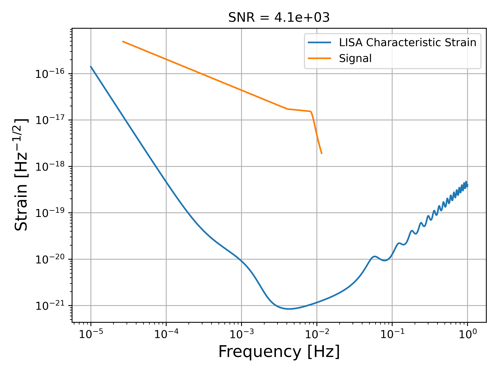

This code is adapted from Robson et al. 2018 (https://arxiv.org/abs/1803.01944, https://github.com/eXtremeGravityInstitute/LISA_Sensitivity) to include the Einstein Telescope and Cosmic Explorer. 

### GW_detector.py

This code takes initialises a gravitational wave detector. The possible options are LISA, Einstein Telescope (ET) and  Cosmic Explorer (CE). The purpose of the detector is to provide a Characteristic Strain so that the Signal-to-Noise ration can be calculated for Massive Black Hole Mergers using the next discussed code, Signal.py

### Signal.py

This code takes the parameters for a black hole binary: primary mass, secondary mass and redshift. The code then uses these parameters to calculate the gravitational wave strain that the coalescence will create. The code can also compare this strain against the sensitivity of a selected GW detector to compute a Signal-to-Noise ratio that the detector should expect to see.

### Merger_IO.py

This code lets the user enter in parameters for a simple merger and will provide a plot showing the strain of the signal with the detector to compare it against, along with the SNR that the merger creates with that detector. The order of the parameters is as follows:

    python Merger_IO.py [Mass 1 (Solar Mass)] [Mass 2 (Solar Mass)] [redshift] [detector]

## Examples

### IO example

### SNR waterfall plot for LISA (top) and ET(bottom)

